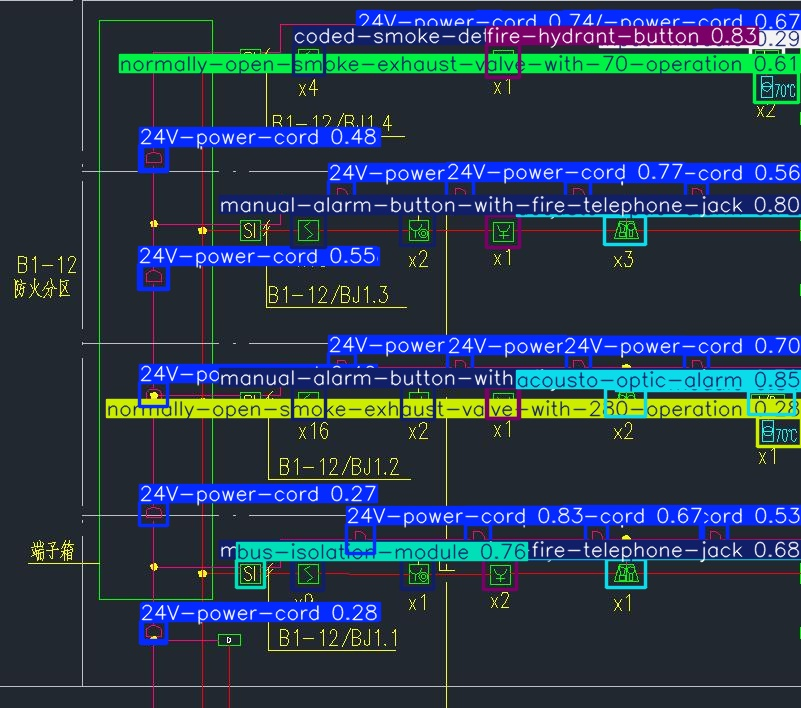
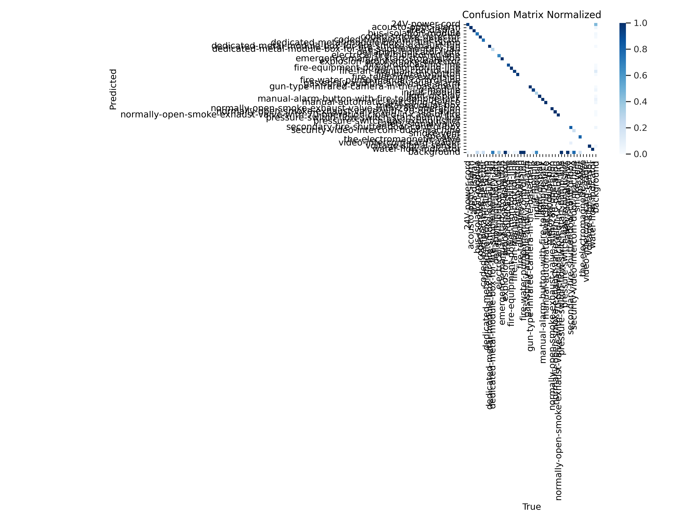
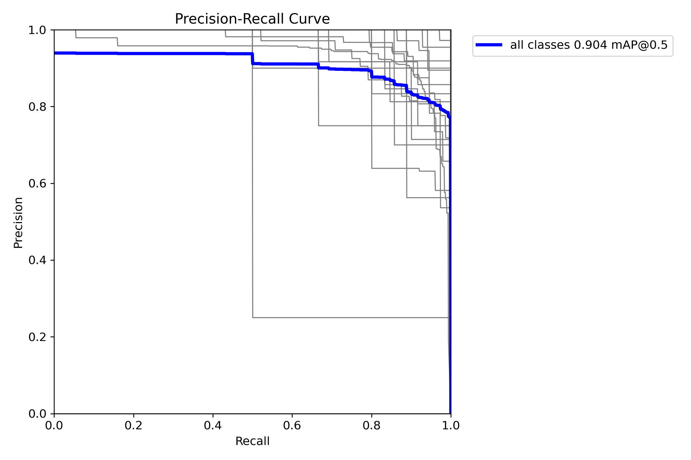

# PyTorch YOLOv10+SimCLR for Firefighting Device Detection
### Contrastive Learning of Visual Representations

- This repository demonstrates how SimCLR cooperates with YOLOv10 to fulfill a Firefighting Device Detection task.
- Below is an image showing detection results from the fine-tuned YOLOv10 model, using the Roboflow test dataset.


### Steps for replicating 
#### 0. Download this repository and set up the environment
  ```
  $ conda create --name SimCLR_yolo python=3.10
  $ conda activate SimCLR_yolo
  $ git clone https://github.com/royliuyu/SimCLR_YOLOv10.git
  $ cd SimCLR_YOLOv10
  $ pip install -r requirements.txt
  ```
#### 1. Prepare the dataset
- We use the original dataset from [Roboflow](https://universe.roboflow.com/yaid-pzikt/firefighting-device-detection/dataset/6).
- We generate the Device components images for SimCLR training. You can download the components dataset with the original Roboflow's [here](https://drive.google.com/file/d/1c_hBfBJ7TJ1nSVY5Ptce5iUJvCyvwfJZ/view?usp=drive_link).
- Extract the downloaded zip file into the "datasets" folder, as 
    ```  
      datasets
        │──Roboflow
        │    ├── train 
        │    ├── valid 
        │    ├── test
        │    ├── components
        │    └── data.yaml ... 
     ```  
#### 2. Train YOLOv10+SimCLR 
- Run below command for training, with Roboflow dataset (components portion). 
    ```
    $ python train_SimCLR.py -dataset-name roboflow  --epochs 100
    ```
- You will get the trained model weights named as "simclr_checkpoint_best.pth.tar" under "output/SimCLR folder".

#### 3. Fine-tune YOLO
- Set up epoch number of pre-trained SimCLR weights in fine_tune_yolo.py if need.
- Run below command to fine-tune YOLOv10.  
  ```
  $ python fine_tune_yolo.py
  ```
- You will get the training/valid/test result in "output/fine_tune" folder.

#### 4. Evaluation
- Below are the results automatically generated when fine-tuning training was completed.
- You can find it in folder of "output/fine_tuned/validation_results/"
- Normalized confusion matrix:
 
- Precision-Recall Curve:
 

#### Acknowledgement
Some of this work is based on [SimCLR](https://github.com/sthalles/SimCLR), thanks to thE valuable contributions.
